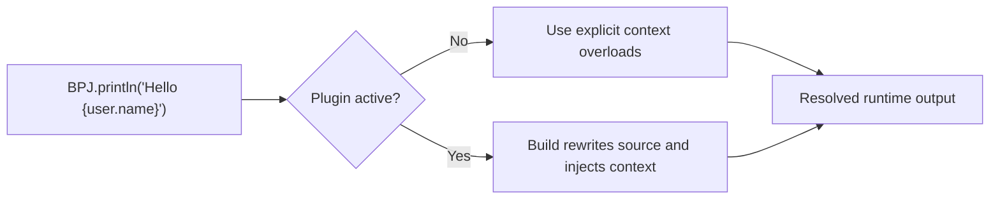

# BPJ (Better Print for Java)

[](https://central.sonatype.com/artifact/io.github.oriontheprogrammer/bpj)
[](https://openjdk.org/)
[](https://central.sonatype.com/artifact/io.github.oriontheprogrammer/bpj-gradle-plugin)
[](LICENSE)
[](https://github.com/OrionTheProgrammer/better-print-java/actions/workflows/ci.yml)

BPJ is a Java 17+ interpolation library that lets you write readable placeholders like `{name}`, `{product.value}` and `{user.getName()}` in `print`, `println`, and `format`.

## Why BPJ

- Reduce Java boilerplate when building dynamic messages.
- Keep source code readable with template-style strings.
- Return interpolated strings with `BPJ.format(...)`.
- Print interpolated text with `BPJ.print(...)` / `BPJ.println(...)`.
- Choose between explicit runtime context or automatic build-time injection.

## How It Works



## Installation

### 1) Runtime dependency (required in all cases)

```xml
<dependency>
  <groupId>io.github.oriontheprogrammer</groupId>
  <artifactId>bpj</artifactId>
  <version>0.3.1</version>
</dependency>
```

```groovy
implementation "io.github.oriontheprogrammer:bpj:0.3.1"
```

### 2) Activate automatic one-argument mode (optional but recommended)

#### Maven options

Option A (`bpj-starter-parent`, easiest):

```xml
<parent>
  <groupId>io.github.oriontheprogrammer</groupId>
  <artifactId>bpj-starter-parent</artifactId>
  <version>0.3.1</version>
</parent>
```

Option B (`bpj-spring-boot-parent`, Spring Boot friendly):

```xml
<parent>
  <groupId>io.github.oriontheprogrammer</groupId>
  <artifactId>bpj-spring-boot-parent</artifactId>
  <version>0.3.1</version>
</parent>
```

Option C (manual plugin, for custom parent including `spring-boot-starter-parent`):

```xml
<build>
  <plugins>
    <plugin>
      <groupId>io.github.oriontheprogrammer</groupId>
      <artifactId>bpj-maven-plugin</artifactId>
      <version>0.3.1</version>
      <executions>
        <execution>
          <goals>
            <goal>prepare</goal>
          </goals>
        </execution>
      </executions>
    </plugin>
  </plugins>
</build>
```

#### Gradle options

Recommended plugin DSL:

```groovy
// settings.gradle
pluginManagement {
  repositories {
    gradlePluginPortal()
    mavenCentral()
  }
}
```

```groovy
// build.gradle
plugins {
  id "java"
  id "io.github.oriontheprogrammer.bpj" version "0.3.1"
}

repositories {
  mavenCentral()
}

dependencies {
  implementation "io.github.oriontheprogrammer:bpj:0.3.1"
}
```

Legacy `buildscript` mode is still supported. See docs below.

## Plugin Activation (Exact Steps)

Use this section if you want one-argument BPJ calls like:

```java
BPJ.println("Hello {name}");
```

to resolve values automatically.

### Maven activation in 3 steps

1. Add BPJ runtime dependency in `pom.xml`.
2. Activate one Maven option:
   - Parent option: `bpj-starter-parent` or `bpj-spring-boot-parent`.
   - Manual option: add `bpj-maven-plugin` with goal `prepare`.
3. Build through Maven:

```bash
mvn clean compile
```

Then verify generated files exist in:
- `target/generated-sources/bpj`

### Gradle activation in 4 steps

1. Add BPJ runtime dependency in `build.gradle`.
2. Add BPJ plugin id in `build.gradle`:

```groovy
plugins {
  id "java"
  id "io.github.oriontheprogrammer.bpj" version "0.3.1"
}
```

3. Ensure `pluginManagement` includes `gradlePluginPortal()` and `mavenCentral()` in `settings.gradle`.
4. Build through Gradle:

```bash
./gradlew clean compileJava
```

Then verify generated files exist in:
- `build/generated/sources/bpj/main`

### IDE note (important)

If you run `main()` directly from IDE without delegated Maven/Gradle build, transformation may be skipped.
Run from terminal or enable delegated build/run in your IDE.

### Static methods note

In Java, `this` is invalid inside `static` methods. Prefer:

```java
BPJ.print("El error es: {e}");
```

with plugin activation, or explicit map context if plugin is disabled.

Compatibility behavior:
- Since `0.3.1`, BPJ plugins also auto-fix `BPJ.print("...", this)` when used in static context, rewriting it to generated map context.
- Recommended style is still one-argument BPJ calls when plugin is active.

## Usage: Plugin OFF vs Plugin ON

| Mode | Example | Notes |
|---|---|---|
| Plugin OFF (explicit context) | `BPJ.format("Hello {name}", Map.of("name", name))` | Always works, no source rewrite needed |
| Plugin OFF (object root) | `BPJ.format("User: {name}", this)` | Resolves from object fields/getters |
| Plugin ON (auto injection) | `BPJ.format("Hello {name}")` | Build plugin injects context automatically |
| Plugin ON (print) | `BPJ.println("Welcome {user.name}")` | Clean one-argument style |

### Without plugin (explicit context)

```java
String text = BPJ.format("Product value: {product.value}", Map.of("product", product));
String text2 = BPJ.format("Hello {name}, age {age}", "name", name, "age", age);
BPJ.println("Welcome {name}", this);
```

### With plugin active (one argument)

```java
BPJ.println("Hello {name}");
BPJ.println("Welcome {user.name}");
BPJ.println("Method call: {user.getName()}");

String text = BPJ.format("Final price: {finalPrice}");
```

## Return `String` Values

BPJ works for returned values, not only console output:

```java
public String retornarTexto(String name, int edad) {
    return BPJ.format("Hola {name}, tienes {edad}");
}
```

Important:
- The no-extra-args form above requires plugin activation.
- If plugin is not active, use `BPJ.format("Hola {name}, tienes {edad}", this)` or explicit map/key-values.

## Verify Plugin Activation

Maven:

```bash
mvn clean compile
```

Check generated sources:
- `target/generated-sources/bpj`

Gradle:

```bash
./gradlew clean compileJava
```

Check generated sources:
- `build/generated/sources/bpj/main`

## Update to New Versions (Maven Central)

1. Check latest published versions:
   - Runtime: <https://central.sonatype.com/artifact/io.github.oriontheprogrammer/bpj>
   - Maven plugin: <https://central.sonatype.com/artifact/io.github.oriontheprogrammer/bpj-maven-plugin>
   - Gradle plugin: <https://central.sonatype.com/artifact/io.github.oriontheprogrammer/bpj-gradle-plugin>
2. Replace `0.3.1` in your `pom.xml` / `build.gradle`.
3. Rebuild:
   - Maven: `mvn -B -ntp clean verify`
   - Gradle: `./gradlew clean build`

## Documentation

- [API reference](docs/API_REFERENCE.md)
- [Plugin activation guide](docs/PLUGIN_ACTIVATION_GUIDE.md)
- [Maven plugin guide](docs/MAVEN_PLUGIN.md)
- [Gradle plugin guide](docs/GRADLE_PLUGIN.md)
- [Spring Boot parent guide](docs/SPRING_BOOT_PARENT.md)

## Visual Assets

Badges and icons are powered by:
- [Shields.io](https://shields.io/)
- [Simple Icons](https://simpleicons.org/)
